# Introduction

The STM32 Nucleo Adapter Card is designed for effortless integration with the Nucleo-144 form factor board. Featuring 144 pin headers, it connects seamlessly to the STM32 Nucleo board without the need for any hardware modifications. Furthermore, it includes a MikroBUS interface that facilitates peripheral expansion.

This guide outlines the process for configuring hardware and software setup for executing Wi-Fi functionality on the [NUCLEO-H723ZG](https://www.st.com/en/microcontrollers-microprocessors/stm32h723zg.html) using FreeRTOS. The tutorial specifically focuses on the example related to IF573.


# Hardware Setup

The image below shows the STM32 Nucleo Adapter Card with the IF573 positioned on top of the [NUCLEO-H723ZG](https://www.st.com/en/microcontrollers-microprocessors/stm32h723zg.html) via Nucleo-144 adapter.

453-00119 (IF573, M2, SDIO) is plugged into M.2 slot.  
	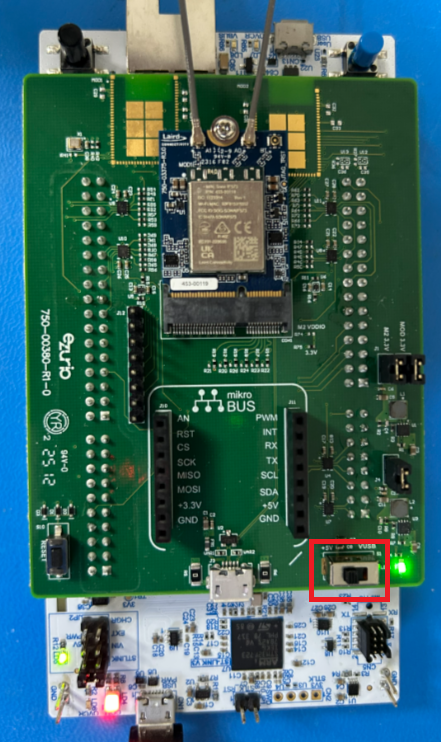

> 💡**Info:** Ensure that the power source is configured to **+5V**.


# Prerequisites

The following software needs to be installed:

- [STM32CubeMX](https://www.st.com/en/development-tools/stm32cubemx.html): For generating code by integrating firmware and packages.
- [STM32CubeIDE](https://www.st.com/en/development-tools/stm32cubeide.html): IDE for compiling, flashing, and debugging via ST-Link.
- [STM32CubeProgrammer](https://www.st.com/en/development-tools/stm32cubeprog.html): For flashing binary files onto STM32 boards.

# Updating Software

## STM32CubeMX: Installing Updates
Launch **STM32CubeMX**:

1. Navigate to **Help > Check for Updates**.
2. Refresh the list, select the new version, and click **Install**.  
	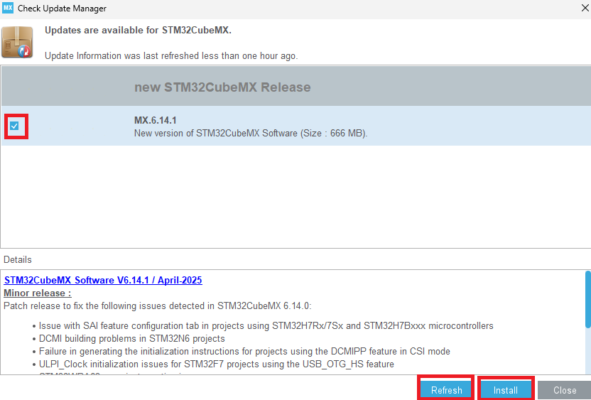

# Install STM32 Connectivity Expansion Pack v1.7.1

1. Open **STM32CubeMX** and select **Install/Remove** under *Manage Software Installation*.  
	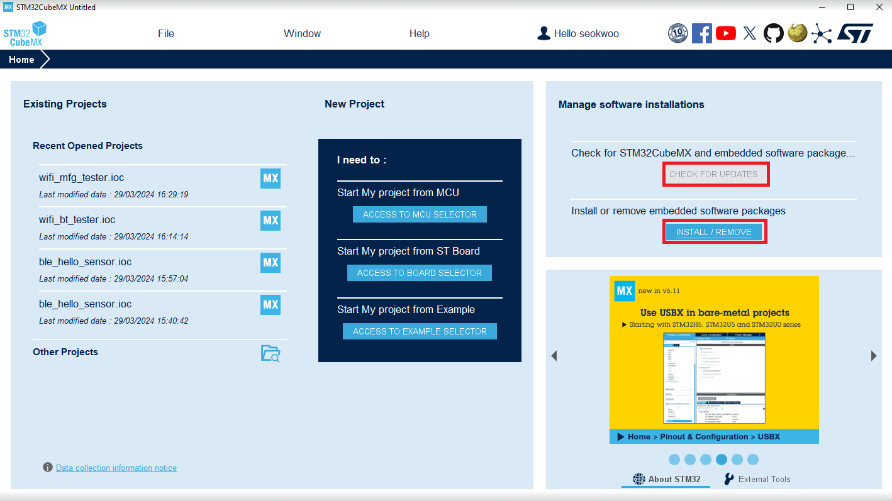
	
2. Click the **Infineon** tab, refresh, select version 1.7.0, and click **Install**.  
	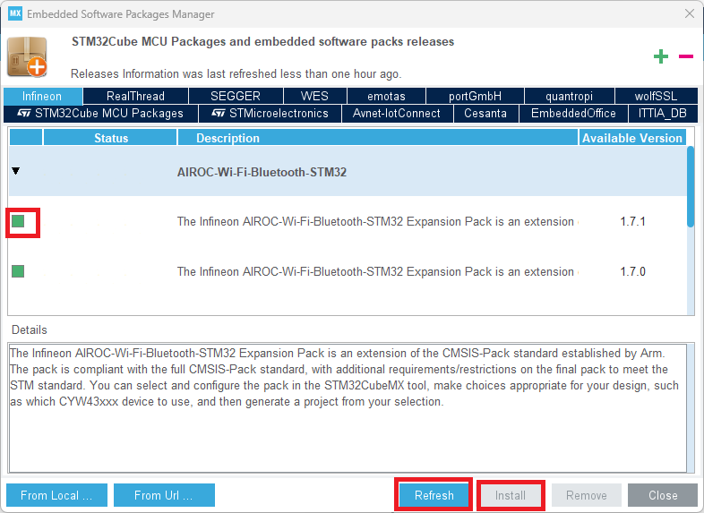

3. Close STM32CubeMX.

# Opening Project through STM32CubeMx

- Download [**wifi_bt_tester_H723ZG.zip**](source/wifi_bt_tester_H723ZG.zip) and extract into:
  
  ```
  C:\Users\%USERNAME%\STM32Cube\Examples
  ```
  
> 💡**Info:** Unlike the *wifi_bt_tester* app provided from the normal expansion pack, this app does not support *iperf* function to reduce the image size (.elf) to fit in 1MB flash on **NUCLEO‑H723ZG**.

- Double-click **wifi_bt_tester_H723ZG.ioc** to open it in STM32CubeMx. Select **Migrate** if prompted.  
	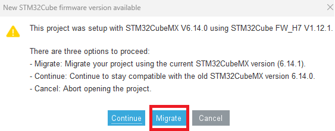

- Click on **Generate Code** to proceed.  
	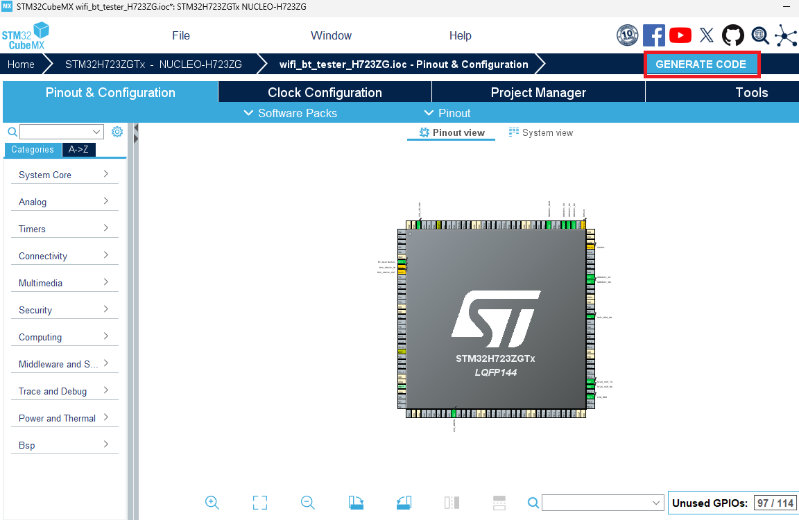

Click on **Open Project**.  
	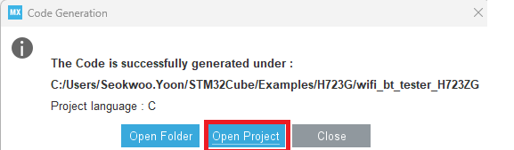

# Building Application in STM32CubeIDE

## Modify source codes

- Delete **bt_cfg.c** and **bt_utility** from:

  `Middlewares > Connectivity > Wireless > MfgTools > command-console`  
  
	  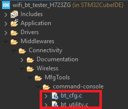

- Under **C/C++ Build > MCU GCC Compiler > Preprocessor**, add macro:

  ```
  BLHS_SUPPORT
  ```
  
  Then, apply and close.

	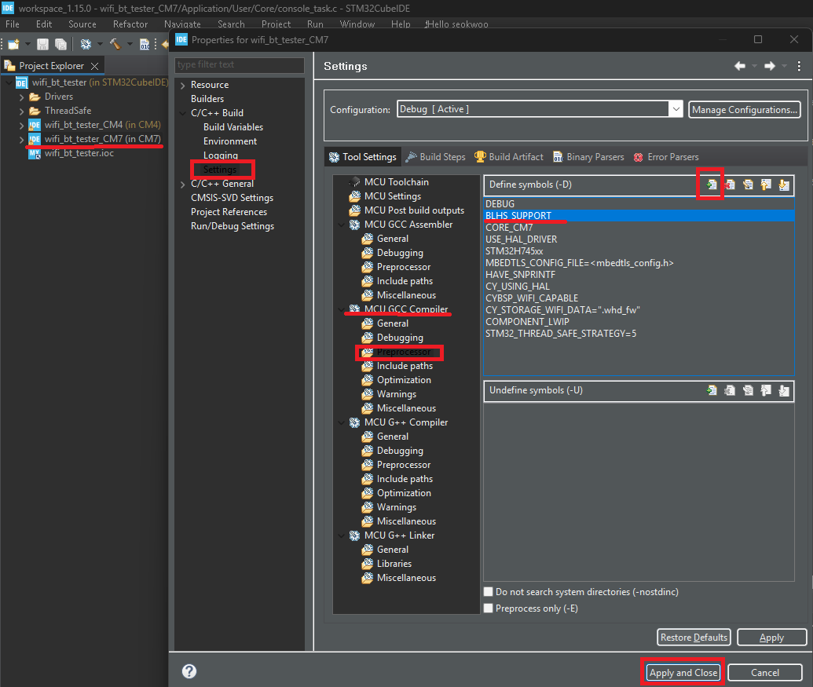

- In File Explorer, browse to `MBEDTLS/App/mbedtls_config.h`, and uncomment the following 2 parameters (line# 216, 1414):

  ```
  #MBEDTLS_PLATFORM_TIME_ALT
  #MBEDTLS_SSL_MAX_FRAGMENT_LENGTH
  ```


## Build Application

- Build application (**Project > Build All**).  
	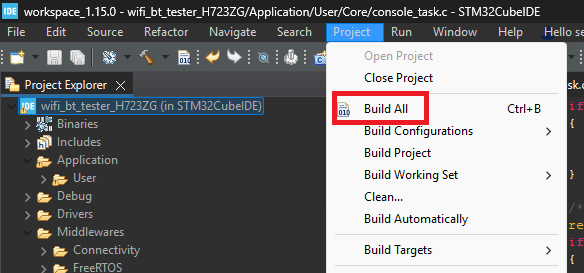


## Flash Application

- Right-click **wifi_bt_tester**, select **Run As > STM32 C/C++ Application**.  
	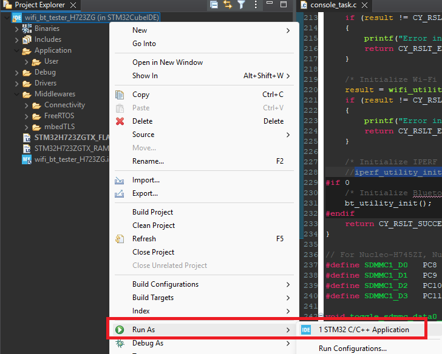
	
- In **Edit Configuration**, confirm `Debug/wifi_bt_tester.elf` is selected, and click **OK**.  
	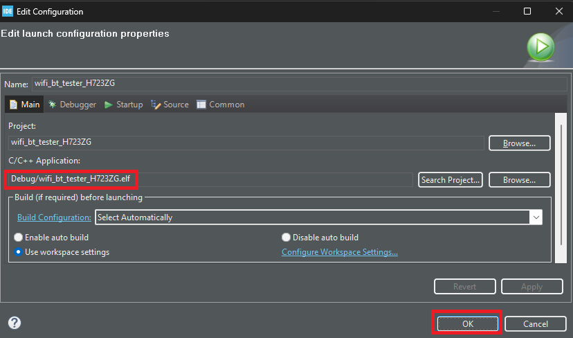

# Running Application

- Configure serial port and new-line receive to **AUTO**.  
	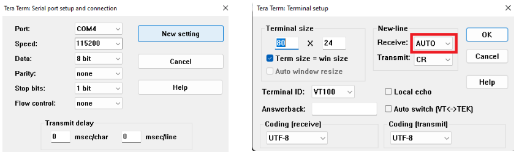
	
- Power cycle the board; Wi-Fi module initializes.  
	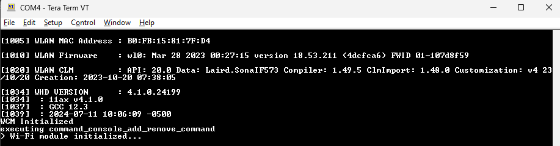
	
- Type `help` to list all available commands.  
	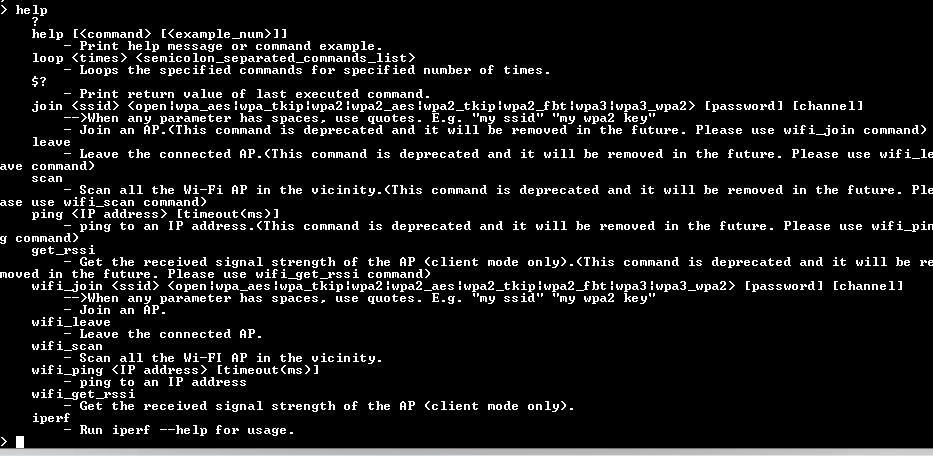
	
- For example, `scan` command scans for Wi-Fi networks.  
	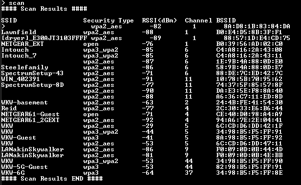
